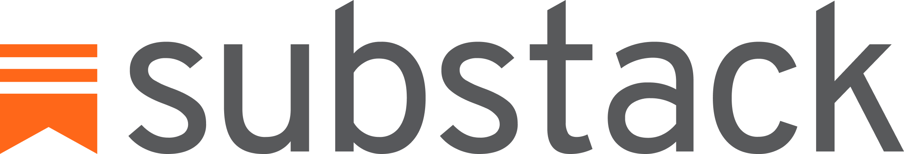

<h2 align="left">Hi 👋, I'm Natasha (Dr. Smith) — Business Scientist | Data & AI Engineer | Economist & Innovator</h2>

I love connecting the dots between data, AI, and strategy to tackle the kind of business problems that keep people up at night. Whether it’s machine learning, predictive modelling, or just good old-fashioned number-crunching, these days I’m all about building AI-powered tools that spark innovation and help organisations make smarter, faster, intelligent decisions. 
  
My real passion? Creating tangible, impactful products that solve big challenges and deliver real, measurable results. Starting as a business economist and shifting into AI engineering gave me a fresh perspective on how to turn data into solutions that actually make a difference — and how to communicate what it all means to stakeholders, ensuring alignment, trust, and action..

###
<h2>💼 My Featured Projects:</h2>

- **[AI-Powered Recipe Assistant: Where Data Science Meets Engineering](https://github.com/drnsmith/AIAssistantRecipe)**  
  _This full-stack project builds an intelligent recipe assistant that personalises cooking experiences. Featuring a user-friendly frontend built with **React**, **Bootstrap**, and **Streamlit**, it enables users to generate recipes, make real-time ingredient substitutions, and customise dietary preferences like vegan or gluten-free. Powered by **Python** and **NLP** and **LLMs** on the backend, the scalable API ensures efficient, AI-driven recommendations, showcasing seamless integration of AI innovation with robust engineering and intuitive design._
  
- **[Secure Communication Framework: Client-Server System with Python and Cryptography](https://github.com/drnsmith/Client-Server-Network-Socket-Programming)**  
  _Developed a robust client-server application using Python socket programming. Features include secure communication through serialisation, file encryption, and multi-threading._

- **[Big Data Sentiment Analysis: Hadoop and NLP for NASDAQ Companies](https://github.com/drnsmith/sentiment-analysis-NASDAQ-companies-Tweets)**  
  _Leveraged Hadoop, MapReduce, and sentiment analysis to process over 4 million tweets about NASDAQ-listed companies, extracting insights into public opinion and sentiment trends._

- **[Machine Learning Predictive Analytics for PM10 Pollution: Using Random Forests, Gradient Boosting, XGBoost, Ridge and Lasso Regressions, and Neural Network Regressor](https://github.com/drnsmith/PM-London-Pollution)**  
  _Applied various advanced machine learning techniques to model and predict PM10 air pollution levels in London (United Kingdom), supporting urban policy decisions for cleaner, healthier cities._

- **[Combinatorial Optimisation with Genetic Algorithms: Solving the 4x4 Puzzle](https://github.com/drnsmith/Solving-a-4x4-Letter-Placement-Puzzle-Using-Genetic-Algorithms)**  
  _Demonstrated the application of evolutionary principles, including mutation, crossover, and selection, to optimise a challenging combinatorial puzzle._

- **[AI-Driven Pneumonia Detection Using CNNs and VGG16](https://github.com/drnsmith/pneumonia-detection-CNN)**  
  _Built a deep learning pipeline to detect pneumonia from chest X-rays. The project compares a custom CNN with a pre-trained VGG16 model for binary classification._

- **[AI-Powered Recipe Difficulty Classification with NLP and Machine Learning](https://github.com/drnsmith/AI-Recipe-Classifier)**  
  _Built and trained an innovative AI classifier to categorise recipes into difficulty levels by analysing ingredients and preparation steps using machine learning and NLP._

- **[Scalable Data Warehouse Design with Snowflake and Oracle](https://github.com/drnsmith/warehouse-management-system)**  
  _Designed a scalable data warehouse for a leading office supply company, featuring a Snowflake schema, ETL processes, and Oracle Database implementation for analytics._

- **[NLP-Driven Recipe Clustering: Topic Modelling with BERT and LDA](https://github.com/drnsmith/RecipeNLG-Topic-Modelling-and-Clustering)**  
  _Used advanced NLP techniques (BERT embeddings and LDA topic modelling) to cluster and semantically analyse recipes, uncovering trends in culinary narratives._

- **[Colour Normalisation in Deep Learning: Enhancing Histopathology Image Classification](https://github.com/drnsmith/ColourNorm-Histopathology-DeepLearning)**  
  _Explored the role of colour normalisation techniques in improving deep learning models for cancer detection from histopathology images._

- **[Custom Convolutional Neural Networks for Histopathology Tumour Classification](https://github.com/drnsmith/Custom-CNNs-Histopathology-Classification)**  
  _Built custom CNNs for histopathology classification using the BreakHis dataset, incorporating advanced techniques like dropout, transfer learning, and batch normalisation._

- **[Building and Training Dense Neural Network for Classifying Images](https://github.com/drnsmith/Designing-Dense-NNs-Using-MNIST)**  
  _Implemented a dense neural network (DNN) for classifying images in the Fashion MNIST dataset with the goal to explore DNN architecture design, activation functions, and regularisation techniques such as dropout, achieving accurate classification of clothing items._

- **[AI-Powered Air Quality Prediction with Regression Models and Advanced Machine Learning Techniques (LSTM)](https://github.com/drnsmith/Pollution-Prediction-Auckland)**  
  _Harnessed AI to model and predict PM10 pollution trends in Auckland (New Zealand) using advanced regression models and LSTM networks to aid environmental policy decisions._

- **[Histopathology AI: Breast Cancer Detection with ResNet, DenseNet, and EfficientNet](https://github.com/drnsmith/Histopathology-AI-BreastCancer)**  
  _Tackled class imbalance and model interpretability challenges in breast cancer diagnosis using cutting-edge architectures like ResNet, DenseNet, and EfficientNet._

###

  
  

###

###

  
  
  
  
  
  
  
  
  
  
  

###

  
  
  <!--  -->
  

###

